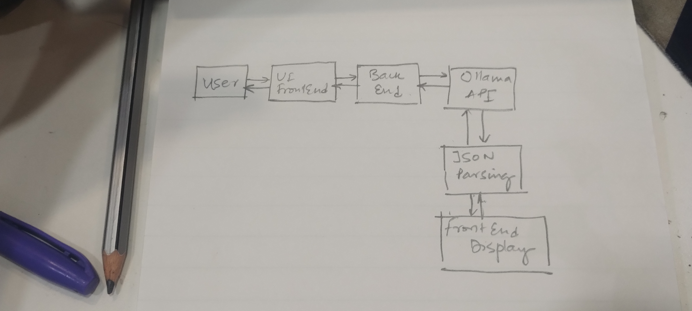

# Trinetra-Analyzer

Challenge 1 (Prompting): Used a single unified prompt instead of multiple prompts to maintain context consistency and reduce latency. 
Challenge 2 (Structured Output): Ensured reliable JSON output using strict format instructions with fallback parsing for malformed responses. 
Challenge 3 (Evidence Linking): Forced every insight to be grounded in transcript evidence to reduce hallucinations and improve explainability. 
Challenge 4 (Uncertainty Handling): Allowed the model to express uncertainty instead of forcing overconfident or incorrect conclusions. 
Challenge 5 (Gap Detection): Added explicit instructions to identify missing skills, behavioral gaps, and improvement areas for balanced evaluation.
